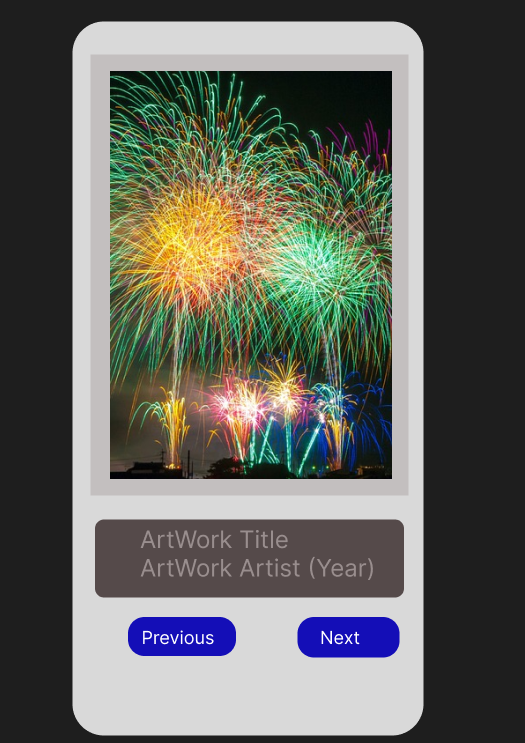

My Art Gallery App
Overview

My Art Gallery App is an Android application developed using Jetpack Compose and Kotlin. The app displays a collection of artwork with details such as the title, artist, and year. Users can navigate through images using "Previous" and "Next" buttons.

Features
Displays artwork images with title, artist, and year.
Navigation through images using "Previous" and "Next" buttons.
Responsive design with Jetpack Compose.
Screenshots

Technologies Used
Kotlin: Programming language for Android development.
Jetpack Compose: UI toolkit for building native Android UIs.
Coil: Image loading library for Compose.
Installation
Clone the repository:

Build and run the app on an Android device or emulator.

Configuration
Image Data: Sample image data is included in MainActivity.kt. You can replace the sample data with your own images and details.
Code Structure
MainActivity.kt: The entry point of the app. Sets up the content and provides sample image data.
GalleryScreen.kt: Manages the display of images and handles navigation.
ImageCard.kt: Displays each image with its title, artist, and year.
ImageData.kt: Data model for image details.
Contributing
Contributions are welcome! Please follow these steps to contribute:

Fork the repository.
Create a new branch (git checkout -b feature-branch).
Commit your changes (git commit -am 'Add new feature').
Push to the branch (git push origin feature-branch).
Create a new Pull Request.
License
This project is licensed under the MIT License - see the LICENSE file for details.

Acknowledgments
Thanks to the developers of Jetpack Compose for providing a modern toolkit for Android UI development.
Thanks to Coil for image loading.